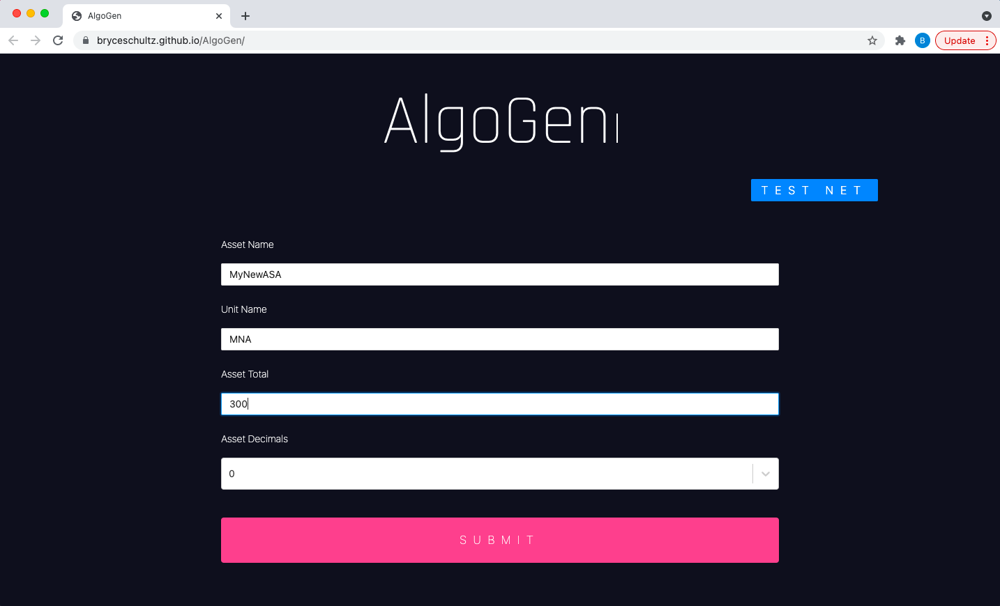
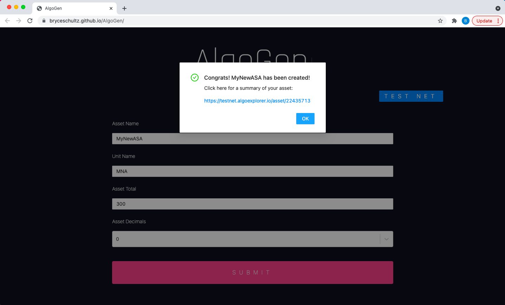

# Getting Started
<br>

## Using the app

### To see a live version of the app go to https://bryceschultz.github.io/AlgoGen

The app allows first time users to easily create an ASA without writing/interpreting any code

<br>

1. Go to https://bryceschultz.github.io/AlgoGen
2. Enter in the desired Asset Name, Unit Name, Asset Total, and Asset Decimals

3. Click Submit and wait for confirmation


<br>
## Creating a local copy

Clone the repo and cd into the directory

```
git clone https://github.com/bryceschultz/AlgoGen.git
cd AlgoGen
```

Install the required dependencies using npm

```
npm install
```

Start the app using yarn
```
yarn start
```
